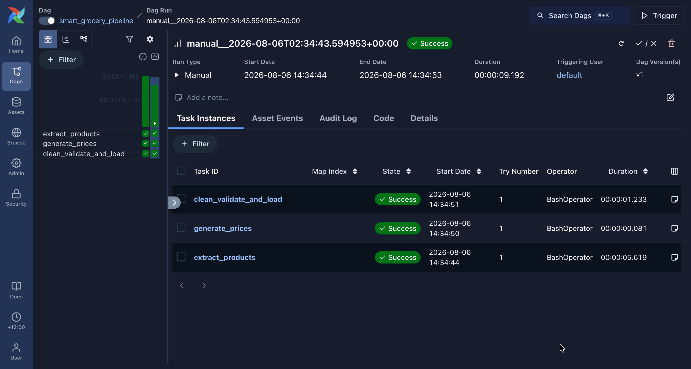
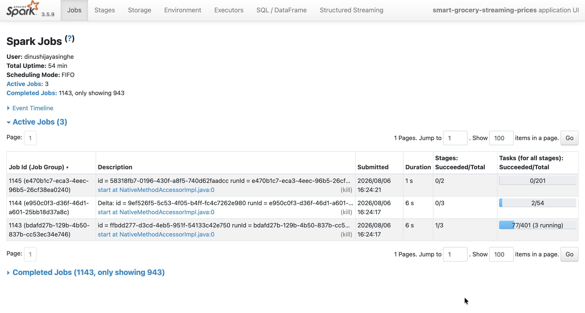
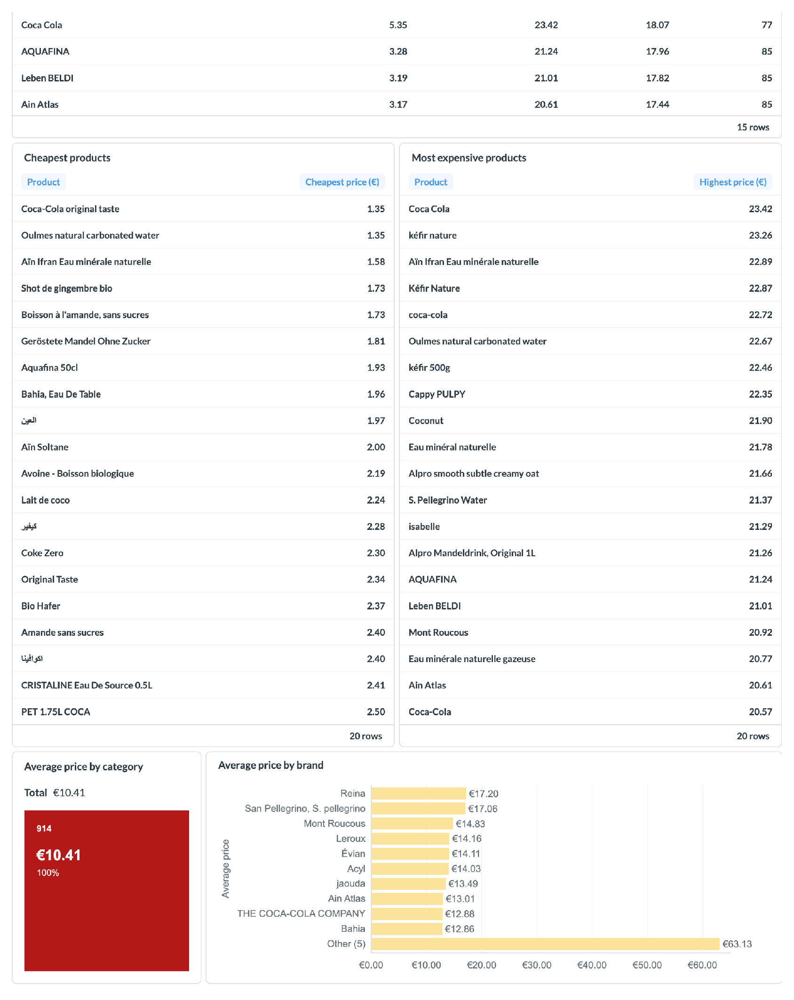
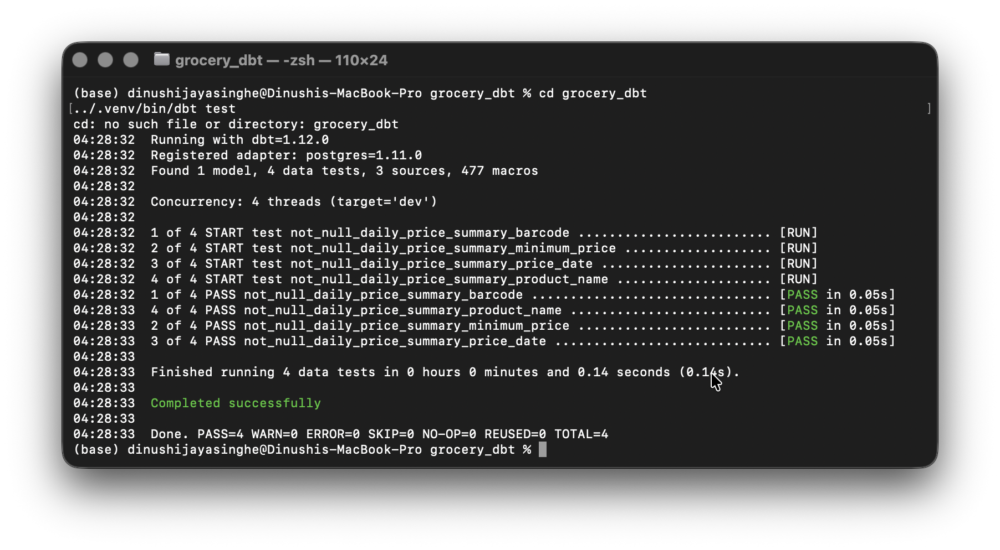
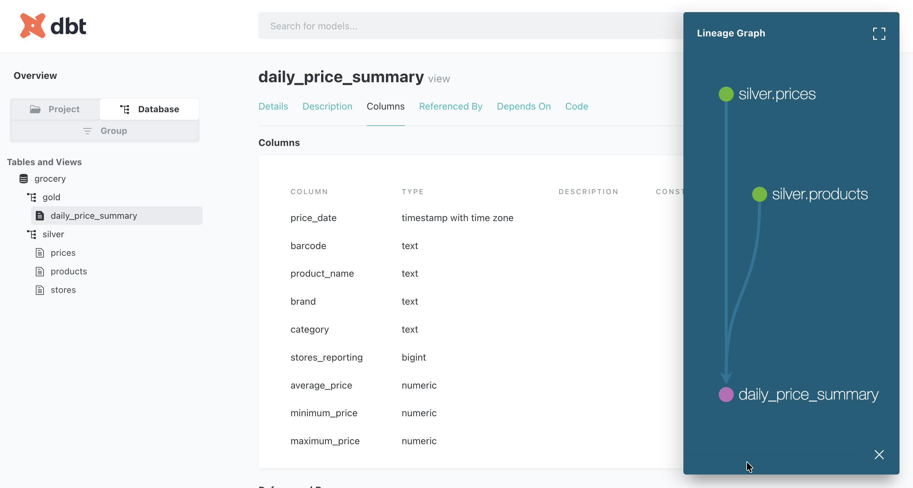

# Smart Grocery Data Lakehouse

[](https://github.com/dinushiTJ/smart-grocery-data-platform/actions/workflows/ci.yml)
[](https://github.com/dinushiTJ/smart-grocery-data-platform/actions/workflows/pages.yml)

**[Read the walkthrough](https://dinushitj.github.io/smart-grocery-data-platform/)**
&middot; [Why it is built this way](docs/interview-notes.md)

A local data platform that takes real product data from Open Food Facts, generates supermarket
prices for it, and pushes both through a validated medallion warehouse into dbt models and
Metabase dashboards. A second, separate path streams the same price events through Spark into
Delta tables, and a DuckDB layer is the only thing that can query both at once.

The point is not the grocery data. It is that **every record can be accounted for**: what
arrived, what was rejected, why, and by which run. Raw data lands in `bronze` before validation,
rejects go to `audit.quarantine` with their reason attached, and every run opens and closes a
row in `audit.pipeline_runs`. The price generator injects faults on purpose, at roughly 8% of
rows, so the quarantine path is exercised on every run rather than sitting untested.

Everything runs locally on open-source tools with `docker compose up -d`. No cloud account is
needed.

### What it demonstrates

- **Batch and streaming ingestion**: a batch path into PostgreSQL and a Spark Structured
  Streaming path into Delta Lake, over the same price events.
- **Medallion modelling** with enforced keys, foreign keys and check constraints in silver.
- **Layered data quality**: deterministic rules in the pipeline, an optional local LLM reviewer,
  Great Expectations suites and dbt tests.
- **Auditability**: raw-before-validate, per-run audit rows, and a quarantine that keeps the
  original record and the reason it failed.
- **Orchestration** with Airflow, **cross-tier queries** in DuckDB, and **SQL index tuning**
  with recorded `EXPLAIN ANALYZE` evidence.
- **A documentation site whose figures are generated from the database** rather than typed, and
  checked for drift.

---

## Architecture

```text
Open Food Facts API          Generated price events (≈8% faults injected)
        |                                   |
        +----------------+------------------+
                         |
                 Bronze (JSON / CSV files
                 + PostgreSQL JSONB tables)
                         |
          Python cleaning and validation  ----->  audit.quarantine
          (+ optional Ollama reviewer)     ----->  audit.ai_validation_results
                         |                 ----->  audit.pipeline_runs
                 PostgreSQL silver
          (products, stores, prices: keys, FKs, checks)
                         |
                  dbt gold models
                         |
                Metabase dashboards

Streaming path:
  price event files --> Spark Structured Streaming --> Delta Lake (data/stream/)
                          (schema, watermark, dedup,        |
                           invalid-event quarantine)        |
                                                            v
                          DuckDB (serving/lakehouse.py): joins Delta + PostgreSQL
```

---

## Open-source stack

| Capability | Tool | License or source |
| --- | --- | --- |
| Source data | Open Food Facts | Open public data |
| Containers | Docker Compose | Compose specification |
| Database | PostgreSQL 17 | PostgreSQL License |
| Orchestration | Apache Airflow | Apache License 2.0 |
| Transformations | dbt Core | Apache License 2.0 |
| Processing | Apache Spark 3.5 and Delta Lake 3.3 | Apache License 2.0 |
| Analytics | DuckDB | MIT License |
| Data quality | Great Expectations | Apache License 2.0 |
| Dashboard | Metabase Open Source (with the DuckDB community driver) | AGPLv3 |
| Local AI | Ollama with a local Qwen model | Open-source software and model licenses |
| CI/CD | GitHub Actions | Hosted service |

No Azure, OpenAI, Snowflake, Databricks, or other paid cloud service is required to run the
project locally. Docker Desktop is used only as the local container runtime; Podman can be
substituted if a fully open-source container runtime is required.

---

## Quick start

Prerequisites: Docker, Python 3.12, and (for the streaming path only) Java 17.

```bash
cp .env.example .env              # then set your own Postgres credentials
python3 -m venv .venv && source .venv/bin/activate
pip install -r requirements.txt

docker compose up -d              # PostgreSQL (schema created from sql/) and Metabase

python3 ingestion/extract_products.py      # Open Food Facts sample -> data/bronze/products/
python3 ingestion/generate_prices.py       # generated prices -> data/bronze/prices/
python3 -m processing.run_pipeline         # validate, load silver, write audit rows
```

Run the test suite:

```bash
python3 -m pytest
```

### dbt

dbt is not part of the Airflow DAG yet. Run it from `grocery_dbt/` with a local profile named
`grocery_dbt` pointing at the same PostgreSQL database:

```bash
cd grocery_dbt
dbt build
```

---

## Bronze, silver and gold

- **Bronze** stores source records without modification, both as timestamped files under
  `data/bronze/` and as PostgreSQL JSONB rows in `bronze.raw_products` and `bronze.raw_prices`.
- **Silver** stores cleaned `silver.products`, `silver.stores` and `silver.prices`.
  `silver.prices` is the fact table, with foreign keys to products and stores and a
  `CHECK (price > 0)` constraint.
- **Gold** contains analytical models such as `gold.daily_price_summary`.
- **Audit**: `audit.pipeline_runs`, `audit.quarantine` and `audit.ai_validation_results` give
  operational and semantic-validation history.

## Data-quality rules

The pipeline applies deterministic rules and records every failure in `audit.quarantine`:

| Dataset | Rules |
| --- | --- |
| Products | Barcode present, meaningful product name (not empty, not equal to the barcode), numeric nutrition values |
| Prices | Event ID present and unique within the file, known product barcode, known store, price present and numeric, price greater than zero, price below 500, valid timestamp, timestamp not in the future |

Additional layers:

- **Great Expectations** suites in `quality/product_expectations.py` and
  `quality/price_expectations.py` assert the same kinds of rules against the bronze files. They
  currently run standalone and are not yet called by the pipeline or the DAG.
- **dbt tests** assert `not_null` on the key columns of `gold.daily_price_summary`.
- **Semantic validation** (below) adds a product-level check that a rule cannot express easily.

## Local semantic validation

Run deterministic semantic checks without any external API:

```bash
python quality/semantic_validation.py data/bronze/products/products_YYYYMMDDTHHMMSSZ.json \
  --output data/quarantine/product_semantic_validation.json
```

Run the optional local Ollama review:

```bash
ollama serve
python quality/semantic_validation.py data/bronze/products/products_YYYYMMDDTHHMMSSZ.json \
  --ollama --model qwen2.5-coder:7b \
  --output data/quarantine/product_ai_validation.json
```

The validator returns `pass` or `reject` with a confidence score and reasons. Inside the
pipeline it is enabled with `OLLAMA_SEMANTIC_VALIDATION=true` and is consulted only for products
that already passed the deterministic rules. A `reject` below 0.90 confidence is recorded but
does not block the load; a `reject` at 0.90 or above quarantines the product (see Known issues).

Every result is stored in `audit.ai_validation_results`:

```sql
SELECT barcode, status, confidence, reasons, validator, validated_at
FROM audit.ai_validation_results
ORDER BY validated_at DESC;
```

---

## Airflow orchestration

Airflow runs as a separate Compose project so its metadata database stays isolated:

```bash
cd airflow_local
cp .env.example .env
docker compose up airflow-init
docker compose up -d
```

Open `http://localhost:8080` and sign in with the credentials from `airflow_local/.env`.

The `smart_grocery_pipeline` DAG runs `extract_products` → `generate_prices` →
`clean_validate_and_load` once per day, with two retries, a five-minute retry delay, catch-up
disabled and one active run at a time.



---

## Streaming path

Generate one event file every two seconds:

```bash
python3 ingestion/generate_stream_events.py \
  data/bronze/products/products_YYYYMMDDTHHMMSSZ.json \
  --stream --interval 2
```

Run the Spark file stream (requires Java 17 with `JAVA_HOME` set):

```bash
python3 processing/streaming_prices.py            # add --once to process available files and stop
```

The stream uses an explicit schema, a ten-minute watermark, event-ID deduplication, Delta
output, checkpointing, invalid-event quarantine and a latest-price aggregation. Kafka is
intentionally not required.

Inspect the Delta tables:

```bash
python3 -m processing.inspect_delta
```



## Cross-tier serving with DuckDB

`serving/lakehouse.py` reads the Delta tables in place with DuckDB and attaches the PostgreSQL
warehouse in the same session, so one query can join a streamed price to product details that
only the warehouse holds. It writes `data/gold/lakehouse.duckdb`:

```bash
python3 -m serving.lakehouse
```

---

## Metabase

Metabase runs at `http://localhost:3001` (host port 3000 is left free for other local apps).

It is built from `metabase.Dockerfile` on a glibc base, because the DuckDB community driver's
native library does not load on the upstream Alpine image. The driver jar is not committed:
download the Metabase DuckDB community driver into `metabase-plugins/` before
`docker compose up`, so dashboards can read the lakehouse file as well as PostgreSQL.

Add the PostgreSQL database using the values from your `.env`. The SQL for every dashboard card
is in `dashboard/metabase_queries.sql`:

- Average price by category
- Cheapest products
- Rejected records by failure reason
- Pipeline status over time
- Products with missing nutrition values
- Price range by store
- Promotion versus normal prices

The dashboard has two tabs, captured from the `2026-08-07T00:15` run so their counts match the
figures on the walkthrough site.




---

## SQL optimisation

Composite indexes on `(barcode, event_timestamp DESC)` and `(store_id, event_timestamp DESC)`
support historical price lookups. The before-and-after `EXPLAIN ANALYZE` results are recorded
in [`docs/query-performance.md`](docs/query-performance.md).

## Data lineage

dbt sources document the silver inputs to gold models. Airflow documents task dependencies, and
the bronze, silver, gold, quarantine and audit paths document the movement and ownership of
records.





---

## CI/CD

`.github/workflows/ci.yml` runs on every push to `main` and every pull request. It:

- installs the Python 3.12 dependencies and runs the full pytest suite;
- enforces the house style of no em dashes in prose, code, SQL or config;
- fails if `site/index.html` references any path outside `site/`, which would silently break
  the screenshots when the page is opened over `file://`.

`.github/workflows/pages.yml` publishes the standalone walkthrough to GitHub Pages on every push
to `main`.

## Verification evidence

The manually triggered Airflow run `manual__2026-08-06T02:34:43.594953+00:00` completed with all
three tasks in `success`. Its audit row reported `450` source records, `396` valid and `54`
rejected.

The most recent successful run, `2026-08-07T03:17` UTC, reported `446` source records, `406`
valid and `40` rejected. PostgreSQL held `97` silver products, `1,517` silver prices and `505`
quarantined records across `11` runs.

Those figures are not copied by hand onto the site. Every number there carries a `data-fig`
attribute and is written from the source of truth by `site/refresh_figures.py` (PostgreSQL) and
`site/refresh_stream_figures.py` (DuckDB). Both accept `--check`, which exits non-zero when the
page has drifted, so a stale page is a failure rather than something a reader has to catch.

Spark and Delta verification produced Delta transaction logs and Parquet files under
`data/stream/delta_prices/` and `data/stream/latest_prices/`. The Delta commit metadata
identifies Apache Spark `3.5.9`, Delta Lake `3.3.2`, append streaming output and a ten-minute
watermark.

The test suite currently passes with `14 passed`.

## The documentation site

The walkthrough is published at
**https://dinushitj.github.io/smart-grocery-data-platform/**.

To view it locally, open [`site/walkthrough.html`](site/walkthrough.html). It is a single
self-contained file with the screenshots inlined, because a browser opening `site/index.html`
over `file://` may be denied access to the `assets` folder beside it. Serving the directory over
HTTP works too:

```bash
cd site && python3 -m http.server 8000
```

Regenerate in this order after any change:

```bash
python3 -m serving.lakehouse            # rebuild the DuckDB file the stream figures read
python3 site/refresh_figures.py         # warehouse figures, from PostgreSQL
python3 site/refresh_stream_figures.py  # streaming and cross-tier figures, from DuckDB
python3 site/build_assets.py            # web copies of the screenshots
python3 site/build_standalone.py        # the self-contained walkthrough.html
```

---

## Design decisions

- PostgreSQL stands in for a commercial warehouse, so the modelling and constraint practice
  carries over.
- File-based streaming is used before introducing Kafka.
- Deterministic rules are the primary gate; the Ollama reviewer is optional and off by default.
- Raw data is preserved before validation so rejected records remain auditable.
- Airflow is isolated from the main Compose stack to keep its metadata database separate.

## Known issues

Found by reading the pipeline code against the claims above. Listed because they are real.

1. **A high-confidence LLM rejection can quarantine a product the rules passed.** The design
   intent is for the reviewer to flag, not overrule. Today a `reject` at confidence 0.90 or above
   blocks the load.
2. **Rejecting a product deletes its existing silver history.** When a product fails validation,
   the pipeline deletes that barcode from `silver.prices` and `silver.products`, so one bad
   re-extract removes prices that were valid when they loaded.
3. **The valid-price count can overstate what was written.** `silver.prices` inserts use
   `ON CONFLICT (event_id) DO NOTHING`, but the counter increments either way, so an event ID
   repeated from an earlier run is counted as loaded without being written or quarantined.
4. **Rerunning on the same file duplicates bronze rows.** Each run reloads the latest file into
   the bronze tables without checking whether it was already processed.
5. **Great Expectations and dbt are not orchestrated.** The suites and `dbt build` run by hand,
   not as DAG tasks.
6. **`gold.daily_price_summary` is defined twice**, as a view in
   `sql/001_create_database.sql` and as a dbt model.
7. **Product history is overwritten.** `silver.products` is upserted in place, so earlier
   versions of a product are not kept.

## Limitations

- Supermarket prices, stores and faults are generated rather than sourced from retailer APIs.
- The Spark stream needs Java and additional memory.
- Metabase cards and screenshots need one-time UI setup, and the DuckDB driver is a manual
  download.
- Ollama review can be slow for large batches and is disabled by default.
- PostgreSQL is suitable for this portfolio deployment, not production scale without further
  hardening.
- Loads are row by row, which is fine at this volume but would not scale.

## Roadmap

1. **Fix the accounting gaps**: make the LLM result advisory only, stop deleting silver history
   on rejection, count only rows actually written, quarantine cross-run duplicate event IDs, and
   skip bronze files already processed. Closes Known issues 1 to 4.
2. **Orchestrate every quality layer**: add Great Expectations and `dbt build` as DAG tasks that
   fail the run on errors, and let dbt own the gold layer. Closes Known issues 5 and 6.
3. **Deepen dbt**: staging models, `unique`, `relationships` and `accepted_values` tests, a
   source `freshness` block, and a snapshot (SCD2) on products. Closes Known issue 7.
4. **Make the AI reviewer measurable**: a small labelled product set with precision and recall
   reported against the deterministic rules, model and prompt versions stored with each result,
   caching by barcode and model version, and structured JSON output.
5. **Price anomaly detection**: a per-product rolling z-score as a gold model or a flag in the
   streaming path.
6. **CI integration test**: a PostgreSQL service container that runs the whole pipeline and
   asserts the audit counts reconcile, plus `dbt build`, an Airflow DAG import test and `ruff`.
7. **Performance and packaging**: batched loads with `executemany` or `COPY`, and separate
   runtime and development requirement files.
8. **Later**: retailer price APIs and backfills, Spark batch transformations over Delta, drift
   monitoring and alerting, OpenMetadata lineage, and cloud deployment with OpenTofu.

---

## Security notes

- No credentials are committed. `.env` is gitignored and has never been in the history.
  `.env.example` lists every variable the code reads, with placeholder values.
- `compose.yaml` takes `POSTGRES_USER`, `POSTGRES_PASSWORD` and `POSTGRES_DB` from `.env`, and
  binds PostgreSQL and Metabase to `127.0.0.1` only.
- The pipeline requires `DATABASE_URL` from the environment and refuses to start without it.
  `airflow_local/docker-compose.yaml` enforces the same with `${DATABASE_URL:?...}`.
- Airflow's own metadata database, admin login and API signing key fall back to defaults in
  `airflow_local/docker-compose.yaml`. Those are for a local stack only and must not be reused
  anywhere shared.
- Supermarket prices, stores and faults are generated. No real retailer pricing is represented.

## Repository layout

```text
ingestion/            Open Food Facts extract, batch price generator, stream event generator
processing/           batch pipeline (run_pipeline.py), Spark stream, Delta inspection
quality/              semantic validation, Great Expectations suites, rule list
serving/              DuckDB layer joining Delta and PostgreSQL
grocery_dbt/          dbt project (sources, gold models, tests)
sql/                  schema, AI validation table, indexes (run on first Postgres start)
airflow_local/        separate Airflow Compose project and DAG
dashboard/            SQL for the Metabase cards
docs/                 interview notes, query performance evidence, screenshots
site/                 walkthrough site and the scripts that generate its figures
tests/                pytest suite
.github/workflows/    CI and GitHub Pages deployment
```
